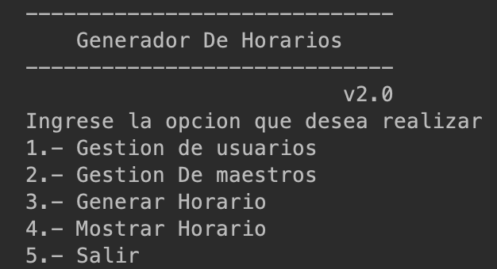
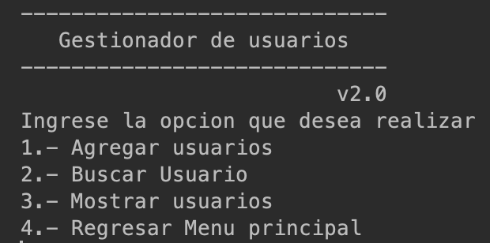
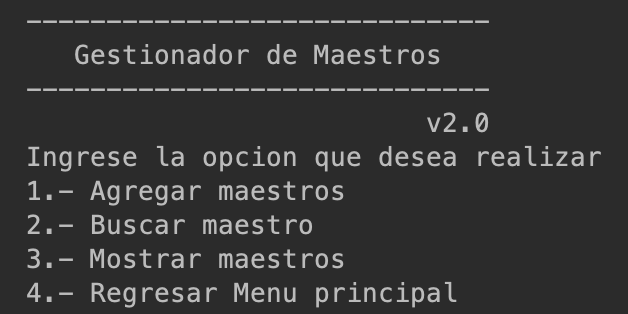
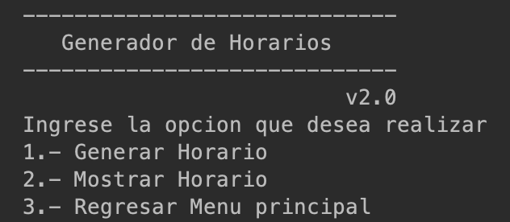
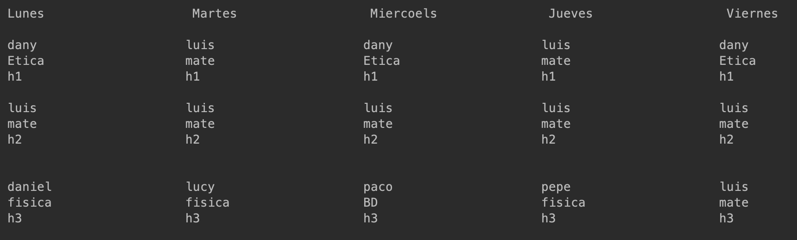

# Producto Integrador de Aprendizaje - POO
___
___

### Integrantes
* **Nombres:**
Ricardo Rocha Moreno
Osmar Eliud Fortuna Hernandez
* **Matricula:**
20764216
2034216
___
# Manual Tecnico
##### Introduccion
Una secundaria esta teniendo problemas para poder administrar los horarios y poder generarlos en donde han esta teniendo problemas de horarios y todo lo hacen ha mano y ya han tenido incidentes en donde se les pierde su organizacion y no lo tienen respaldado en una impresion o guarda en un formato.

**Solucion:** Despues de estar analizando consideramos realizar una interfaz grafica donde la secundaria pueda almacenar los datos des los profesores, su materia y la hora que dan los maestros y su dia. Tambien hara que automaticamente no se choquen los horarios con otros maestros, y se imprima lo que es el horario asignado que eligeron, tanto el nombre del maestro, su materia y su hora establecida en ese dia.

##### ¿Que hace el programa?

* Al momento de ejecutar el programa nos solicitara ingresar un usuario y una contraseña las cuales estan guardadas en un archivo de texto

  

* Tenderemos un menu como inicio, en las cuales podremos seleccionar la opcion requerida

  

* En la primera opcion veremos toda la gestion de usuarios en las cuales podremos agregar y buscar

  

* En la segunda opcion podremos agregar maestros sin repetir, y se guardan datos personales y su materia que dara

  

* por ultimo esta la opcion de generar horarios, en la cual podremos elejir un horario, y llenar todos los dias, para llenar un dia se solicita el nombre del maestro
 

  

* Al momento de integrar el horario elgimos la siguiente distribucion de horas para mayor facilidad
 

  

* Todos los datos guardados se podran desplegar en su seccion correspondiente
---
---
##### Resultados
Gracias al programa pudimos reducir un 70% de tiempo en la generacion de horarias de la fomra habitual que lo tenia acostumbrado la secundaria y gracias ha ello tenian todos los datos guardados y no tenian riesgo de perder los archivos genereado

  

