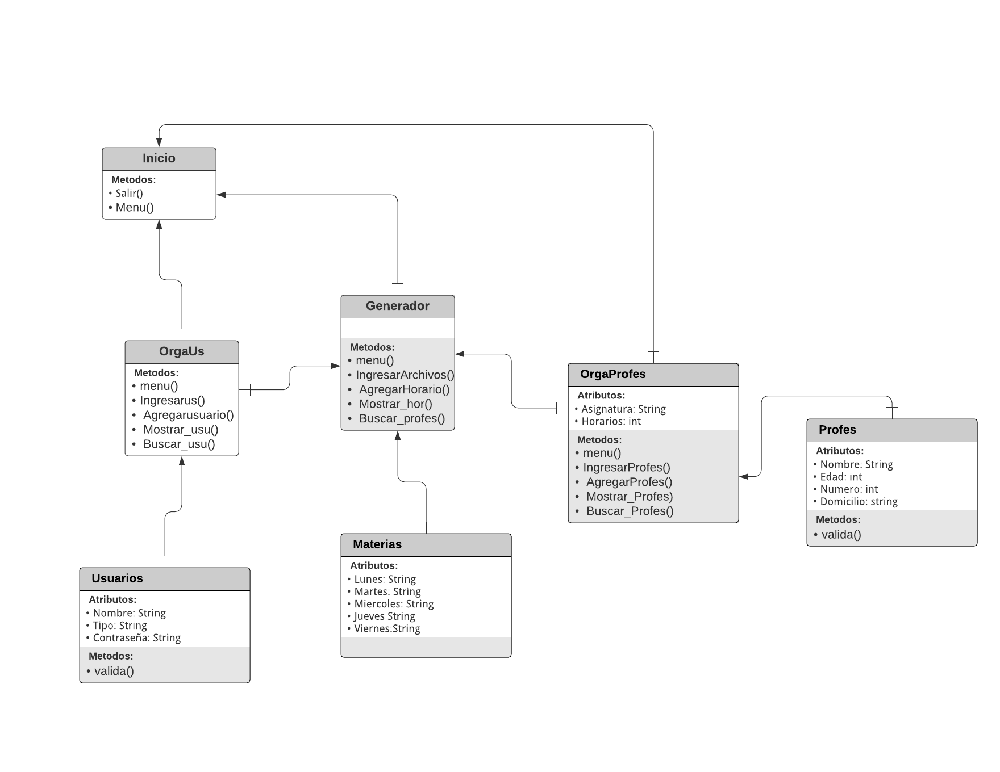

# Producto Integrador de Aprendizaje - POO
___
___

 ### Integrantes 
* Nombres:  

Ricardo Rocha Moreno  
Osmar Eliud Fortuna Hernandez
* Matriculas: 

2034216

2076182
___
### Introduccion
Una secundaria tiene problemas para generar y administrar los horarios, pues muchos maestros no tienen facilidad de horario y siempre tiene problemas de empalmamiento de horarios, ademas se les dificulta imprimir el horario.  

**Solucion:** Realizar una interfaz grafica donde el usuario pueda almacenar los profesores y las materias ademas de condicionar los horarios de los profesores que no tengan disponibilidad y generar aleaotoriamente el horario complete e imprimirlo

___
### Principales cambios
-Se redujieron el numero de clases y a algunas se les cambio el nombre-

-Se eliminaron parametros tales como las de las clases materias pues no tenian mucho sentido-

-Se modifico la grafica UML y ahora es mas coherente-

-Se utilizaron mas metodos de los esperados-

-Se implementaron arreglos y se vinculo con archivos de txt-

-Se hizo una gestion mas de lo esperado con el vinculo con los archivos-
___
### Cualidades A mejorar
*Se pude optimizar a un mas el programa
*Se pueeden implementar funciones mas utiles

___
### Entidades:
**Primeras Clases Propuestas Para La Aplicacion**    

Clase De La Funcion Principal: **Inicio**

Clase Respecto a la administrasion de usuarios: **Usuarios**

Clase para ingresar a profesores: **Profes** 

Calse extendida de profes para verificacions y disp de horarios: **OrgaProfes** -Se modifico a Gestprofes-

Clase para ingresar materias: **Materias**

Clase extendida de materias para añadir descripsiones y horarios: **OrgMaterias** -Se modifico a GestUsuarios-

Clase para generar el horario: **Generador**

Clase para generar un horario mas avanzado: **GenAvanz** -Se elimino esta clase-

---
### Atributos:
**Contenido Propuesto que tendrán las entidades, así como las funciones**  

**Inicio:** *Aqui se llamaran todas las funciones*  

**Usuarios:**
- Nombre
- Tipo
- Contraseña

**GestUsuarios:** 

* menu() //*Menu donde se mandan a llamar metodos*
* IngresarUsArchvios() //*Agrega usuarios a los archivos*
* AgregarUs() //*solicita los datos de los usuarios *
* MostrarU() //*Muestra los datos de los usuarios *
* BuscarUs() //*Busca los datos de los usuarios *

**Profes:**
- Nombre
- Materia
- Edad 
- Numero
- Domicilio  

**GestProfes:**
* menu() //*Menu donde se mandan a llamar metodos*
* IngresarProfes() //*Agrega maestros a los archivos*
* AgregarUs() //*solicita los datos de los maestros *
* MostrarU() //*Muestra los datos de los maestros *
* BuscarUs() //*Busca los datos de los maestros *

**Generador:**
* menu() //*Menu donde se mandan a llamar metodos*
* IngresarArchivos() //*Agrega los horarios a los archivos*
* AgregarHorario() //*solicita los datos de los maestros *
* Mostrar_hor() //*Muestra el horario de los maestros *
* Buscar_profes() //*Busca los datos de los maestros *

**GenAvanz** 
//En progreso
* Gen() // *Imprime horario especifico solo para gerarquia mas alta*

---
### Funcionalidades
**Funcionalidades Propuestas Para La Aplicacion** 
- ArrayList<Profes>();

---
### Desmostracion Del Proyecto
https://youtu.be/VORf3GRMREU
----
 ---
### Diagrama UML

